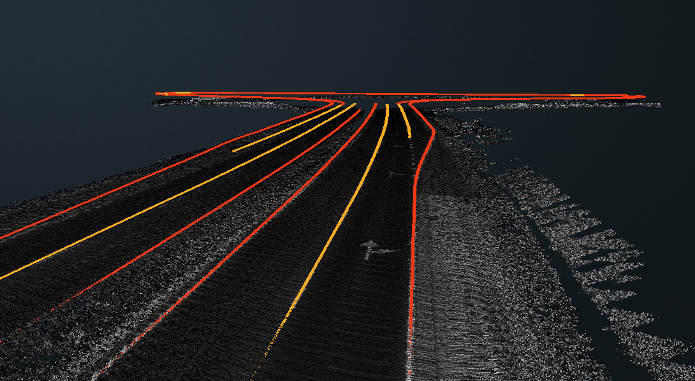
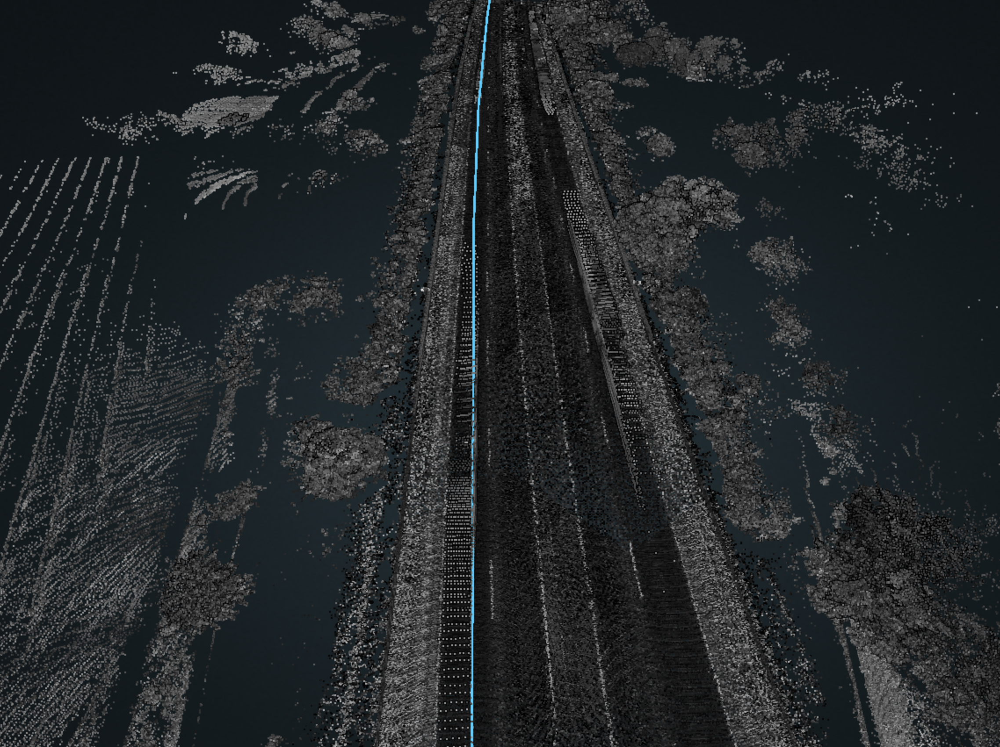
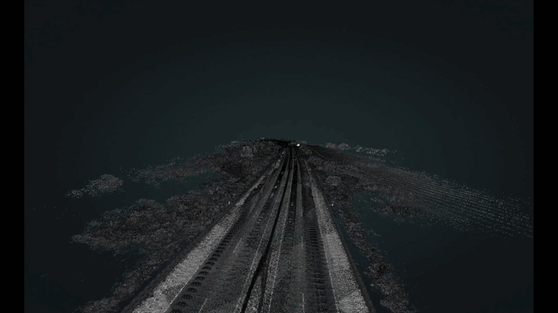
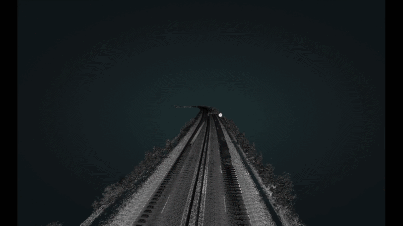
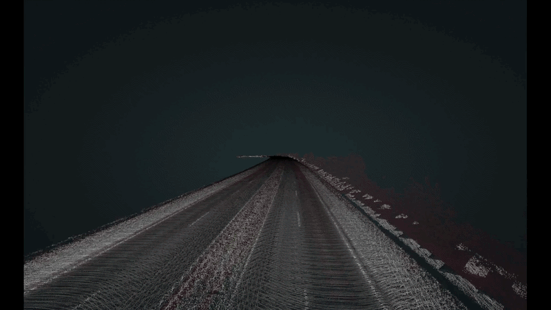
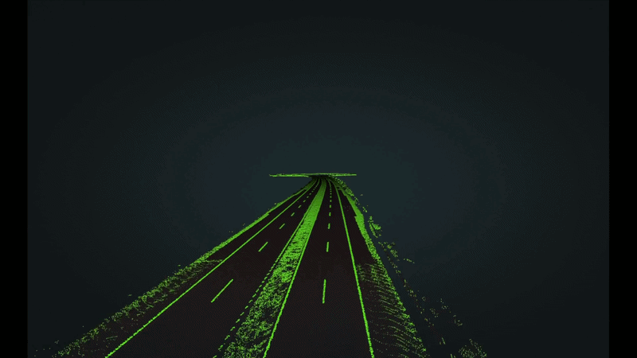
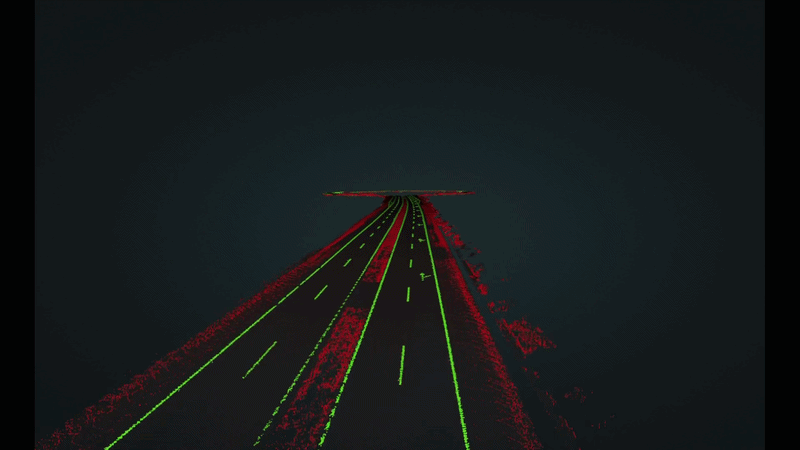

# Lane Detection from LiDAR Data



Thesis project for extracting lane-divider geometries from SLAM-stitched, georeferenced LiDAR point clouds.

- **Input**: A large stitched LiDAR scan (`.las/.laz` 100+ Million points)
- **Output**: Lane divider geometries in a GeoPackage, labelled as `solid` or `dashed`

## Pipeline

The pipeline processes the point cloud through the following sequential steps:

1. **Detect Car Trace** — Reconstruct the vehicle trajectory to approximate lane positions. 
2. **Distance Clip** - Points that are far from the car trace are discarded. 
3. **Segment Ground** — Filter out noise; retain only ground-level points. 
4. **Intensity Thresholding** — Discard low-intensity points unlikely to be lane markings. 
5. **Segment Road Markings** — Isolate points on the road surface. 
6. **Fit and Label lines** — Fit lines to road marking clusters using a line-growing algorithm, then label them. 


## Running the pipeline

```bash
uv run src/lane_detection/main.py config/full_pipeline.json
```

This will run the pipeline steps on the lidar data defined in the congig file and create an output folder in `data/ouput`.

The pipeline is driven by a JSON config file. Each step is identified by a keyword defined in `main.py` and executed in order, with each step updating a shared pipeline context. See [config/full_pipeline.json](config/full_pipeline.json) for a reference configuration.

> **Note on coordinate systems**: All distance parameters in the config are interpreted in the coordinate system of the input LiDAR file. For data in `EPSG:3857` (Web Mercator), there is a scale distortion relative to real-world distances — approximately 1.5× at Hungarian latitudes. For example, a 15 m clip distance in the config corresponds to roughly 10 m on the ground.

## Visualisation

Point clouds are visualised using [Potree](https://github.com/potree/potree). The `.laz` files must first be converted to EPT tiles. See [potree_vis/README.md](potree_vis/README.md) for instructions.